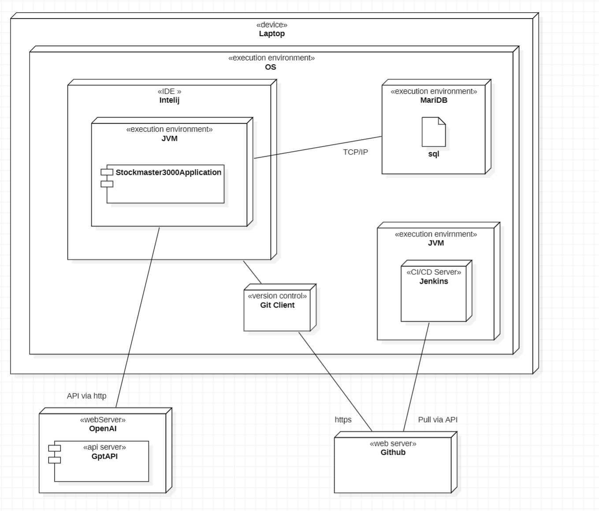
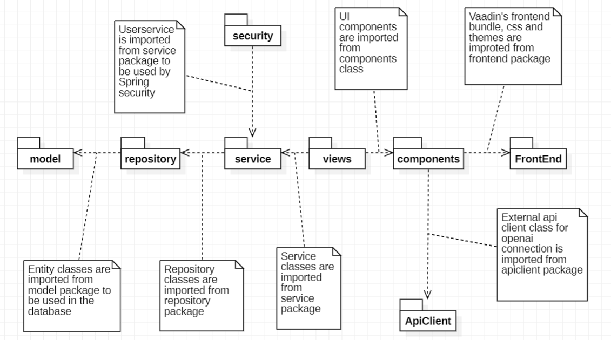
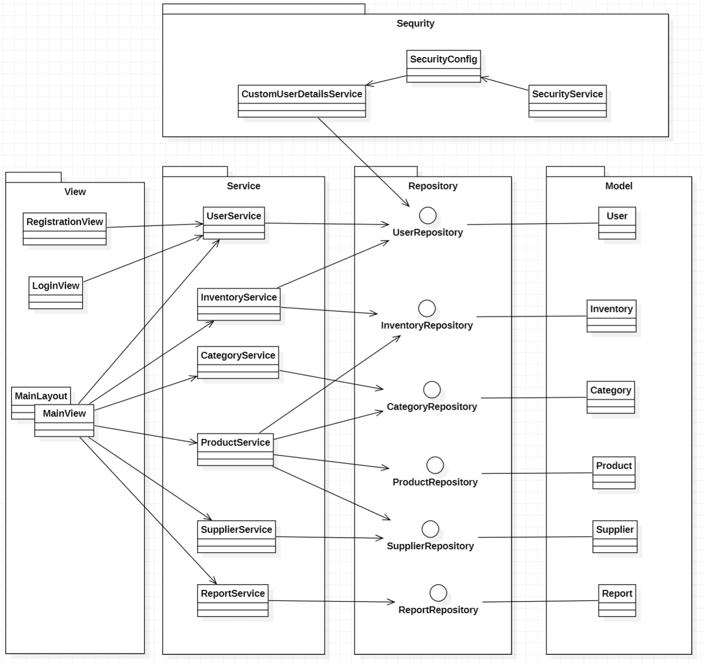
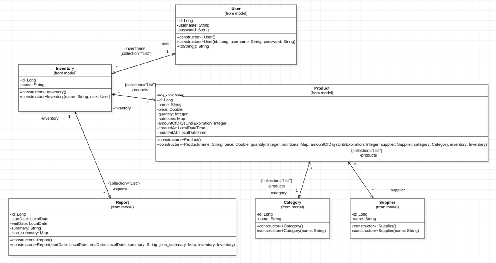

# **Product Vision: StockMaster3000**
## Overview
This is a Java Spring Boot project that integrates with OpenAI's API for various functionalities. The project uses Vaadin for the front-end and MariaDB as the database. It requires specific configurations to run in production mode.

## **Problem Statement**
We assume that peoples often struggle to keep track of the items in their refrigerator and pantry, leading to food waste, overspending,
or even unhealthy eating habits. Existing solutions are not easy to use, frustrating users who want to streamline their grocery management and make rational decisions.

## **Target Audience**
The StockMaster3000 is designed for:
- Individuals and families aiming to reduce food waste.
- Health-conscious users interested in monitoring their diet.
- Budget-conscious shoppers seeking insights into their spending habits on groceries.
- Students and busy professionals looking for a simple, efficient way to manage food inventory.

## **Value Proposition**
The StockMaster3000 simplifies food inventory management by providing:
- **Effortless tracking** of items stored in the refrigerator.
- **Streamlined shopping experiences** by keeping track of resource levels and generating smart grocery lists.
- **Insights into diet and health**, including calorie counts and nutrient breakdowns.
- **Cost analysis** to help users stay within budget and plan purchases effectively.
- **Alerts and reminders** for expiration dates to minimize food waste.

## **Key Features and Functionality**
1. **User Authentication and Registration**
   - Secure login and account creation for personalized data storage.

2. **Product Inventory Management**
   - Add, edit, and categorize items with attributes like quantity, expiration date, and nutritional information.
   - Receipt scanning or manual entry for item details.

3. **Stock In/Out Transactions**
   - Track stock additions (purchases) and removals (consumption).
   - Integration with grocery lists for easy reordering.

4. **Reports and Analytics**
   - Visualize spending patterns and food usage trends over time.
   - Generate insights on calorie intake and diet healthiness.
   - Summary of food waste with suggestions for improvement.

## **Goals and Objectives**
- Create a **simple and intuitive application** that is easy to use for all users.
- Ensure **stable and reliable code** to provide a seamless experience.
- Offer **useful insights and tools** to help users efficiently manage their inventory and shopping.
- Minimize bugs and ensure smooth functionality for **consistent user satisfaction**.


## **Vision Statement**
Our vision is to simplify the way people manage and understand their food consumption. By combining intuitive
inventory tracking with actionable insights, StockMaster3000 empowers users to make healthier, more sustainable,
and cost-effective food choices. We aim to reduce food waste and foster smarter shopping habits
for a better tomorrow.

---

## Prerequisites
Before running this application, ensure you have the following installed:

- **Java 17+** (preferably the latest LTS version)
- **Maven 3.8+**
- **MariaDB** (for database functionality)
- **OpenAI API Key** (for integration with OpenAI API)
- **Docker** (optional for Docker Compose)
- **Jenkins** (optional)

Here is visualisation of required development environment for our project:



### Installing MariaDB
If you don't have MariaDB installed, you can install it using the following instructions based on your operating system:

#### On Ubuntu:
```bash
sudo apt-get update
sudo apt-get install mariadb-server
sudo systemctl start mariadb
sudo systemctl enable mariadb
```

#### On macOS (using Homebrew):
```bash
brew install mariadb
brew services start mariadb
```

#### On Windows:
Download and install MariaDB from [MariaDB Downloads](https://mariadb.org/download/), and follow the setup instructions.

After installing MariaDB, ensure that it's running and accessible by connecting to the MariaDB server:

```bash
mysql -u root -p
```

Once connected, you can run the sql script in the resources folder to grant your user the appropriate privileges for the application to work.

## Setup Instructions

### 1. Clone the repository
Start by cloning this repository to your local machine:

```bash
git clone https://github.com/SaedAbukar/StockMaster3000.git
cd StockMaster3000
```

### 2. Set up `.env` file
Create a `.env` file in the root of the project directory and add your OpenAI API key:

```bash
# .env
OPENAI_API_KEY=your_openai_api_key_here
```

Make sure to replace `your_openai_api_key_here` with the actual OpenAI API key. This file should **not** be committed to version control for security reasons.

### 3. Configure MariaDB Connection
In the `src/main/resources/application.properties` file, configure the MariaDB connection settings. Set your database username and password:

```properties
# MariaDB Configuration
spring.datasource.username=your_db_username
spring.datasource.password=your_db_password
```

Make sure to replace `your_db_username` and `your_db_password` with your MariaDB credentials.

### 4. Build the project
To build the project using Maven in production mode (to enable Vaadin features), use the following command:

```bash
mvn clean install -Pproduction
```

This command ensures that the production profile is used, which is important for enabling Vaadin features correctly.

If you want to use the `spring-boot` run feature, you can run the following command:

```bash
mvn spring-boot:run
```

### 5. Run the Application
Once the project is built, you can run it using the following command:

```bash
mvn java -jar target/stockmaster3000-0.0.1-SNAPSHOT.jar
```

This will start the Spring Boot application. You should be able to access the application in your web browser at:

```
http://localhost:8081
```

### 6. Using Docker Compose
If you prefer to use Docker Compose to run the application along with MariaDB, you can do so by using the pre-configured Docker files in the repository.

To start the application with Docker Compose, run the following command:

```bash
docker-compose up
```

This will set up the necessary containers for the Spring Boot application and MariaDB, running everything in isolated environments. Once the services are up, you can access the application at:

```
http://localhost:8081
```

### 7. Environment Variables
Ensure the following environment variable is set in the `.env` file to use OpenAI API:

- `OPENAI_API_KEY`: Your OpenAI API key.

Also, ensure the `.env` file is located at the root of the working directory.

## Troubleshooting

### Issue: OpenAI API Key not working
- Ensure that the API key in the `.env` file is correct.
- Check that you have internet access and that OpenAI's API servers are not down.

### Issue: Vaadin-related issues
- If Vaadin components are not rendering, make sure you are building the project with the `-Pproduction` flag as described in the build section.

### Issue: MariaDB Connection Issues
- Ensure that MariaDB is running and accessible at the correct port (`3306` by default).
- Ensure that your `application.properties` file is properly configured with the correct MariaDB credentials (`username`, `password`, and database name).
- Test your connection to MariaDB using the following command to ensure it’s accessible:

```bash
mysql -u your_db_username -p -h localhost -P 3306
```

### Issue: Maven Build Fails
- Ensure Maven is installed correctly and the environment is set up for Java 17 or higher.
- If Maven is not installed, you can use the Maven wrapper with the following command:

```bash
./mvnw clean package -Pproduction
```

- If the build fails, try running `mvn clean` and then `mvn install -Pproduction` to resolve any build issues.

---
## **Overview Of Project structure**

1. **Package Diagram**



2. **Large Scale Class Diagram**



3. **Main Classes Diagram**

